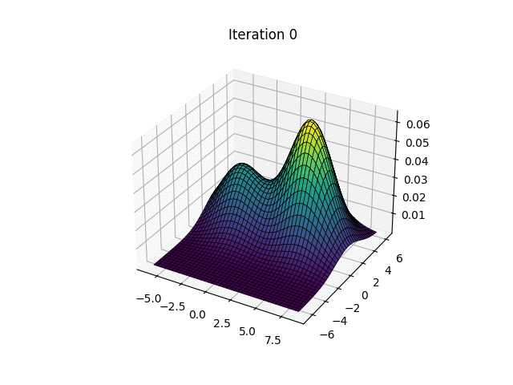

# Machine Learning Algorithms from Scratch

This repository contains implementations of various machine learning algorithms from scratch. Each algorithm is presented in a Jupyter Notebook along with corresponding Python modules.

  
  

## Algorithms Included

- [Bias-Variance Tradeoff](Bias_Variance_Tradeoff.ipynb)
- [Decision Trees](Decision_Trees.ipynb) ([Python Code](mllib/decision_tree.py))
- [Gradient Boosting](Gradient_Boosting.ipynb) ([Python Code](mllib/gradient_boosting.py))
- [K-Means Clustering](KMeans.ipynb) ([Python Code](mllib/kmeans.py))
- [K-Nearest Neighbors (KNN)](KNN.ipynb) ([Python Code](mllib/knn.py))
- [Linear Regression](Linear_Regression.ipynb) ([Python Code](mllib/linear_regression.py))
- [Logistic Regression](Logistic_Regression.ipynb) ([Python Code](mllib/logistic_regression.py))
- [Optimizers](Optimizers.ipynb) ([Python Code](mllib/optimizers.py))
- [Gaussian Mixture Model](Gaussian_Mixture_Model.ipynb) ([Python Code](mllib/gmm.py))

## mllib Module

The `mllib` module contains the Python implementations of the algorithms. Here's an overview of the modules:

- [adam.py](mllib/adam.py): Implementation of the Adam optimizer.
- [base.py](mllib/base.py): Base classes for machine learning algorithms.
- [decision_tree.py](mllib/decision_tree.py): Decision tree algorithm.
- [gmm.py](mllib/gmm.py): Gaussian Mixture Model implementation. 
- [gradient_boosting.py](mllib/gradient_boosting.py): Gradient boosting algorithm.
- [kmeans.py](mllib/kmeans.py): K-Means clustering algorithm.
- [knn.py](mllib/knn.py): K-Nearest Neighbors algorithm.
- [linear_regression.py](mllib/linear_regression.py): Linear regression algorithm.
- [logistic_regression.py](mllib/logistic_regression.py): Logistic regression algorithm.
- [optimizers.py](mllib/optimizers.py): Various optimization algorithms.
- [random_forest.py](mllib/random_forest.py): Random Forest algorithm.
- [qr.py](mllib/qr.py): QR decomposition algorithm.
- [utils.py](mllib/utils.py): Utility functions.

## Usage

Each algorithm is presented in a Jupyter Notebook for easy exploration and understanding. The corresponding Python modules in the `mllib` directory provide the implementation details.

## License

This repository is licensed under the [MIT License](LICENSE).

For detailed information about each algorithm, refer to the respective Jupyter Notebook and Python modules.

---

TODO: Algorithms to add.
- Add Naive Bayess
- Add SVM
- Add Spectral Clustering
- Add SVD
- Add matrix inverse via SVD
- Add PCA 

---
TODO: General things.

- [ ] Add comments and docstrings  
- [ ] Refactor as package

